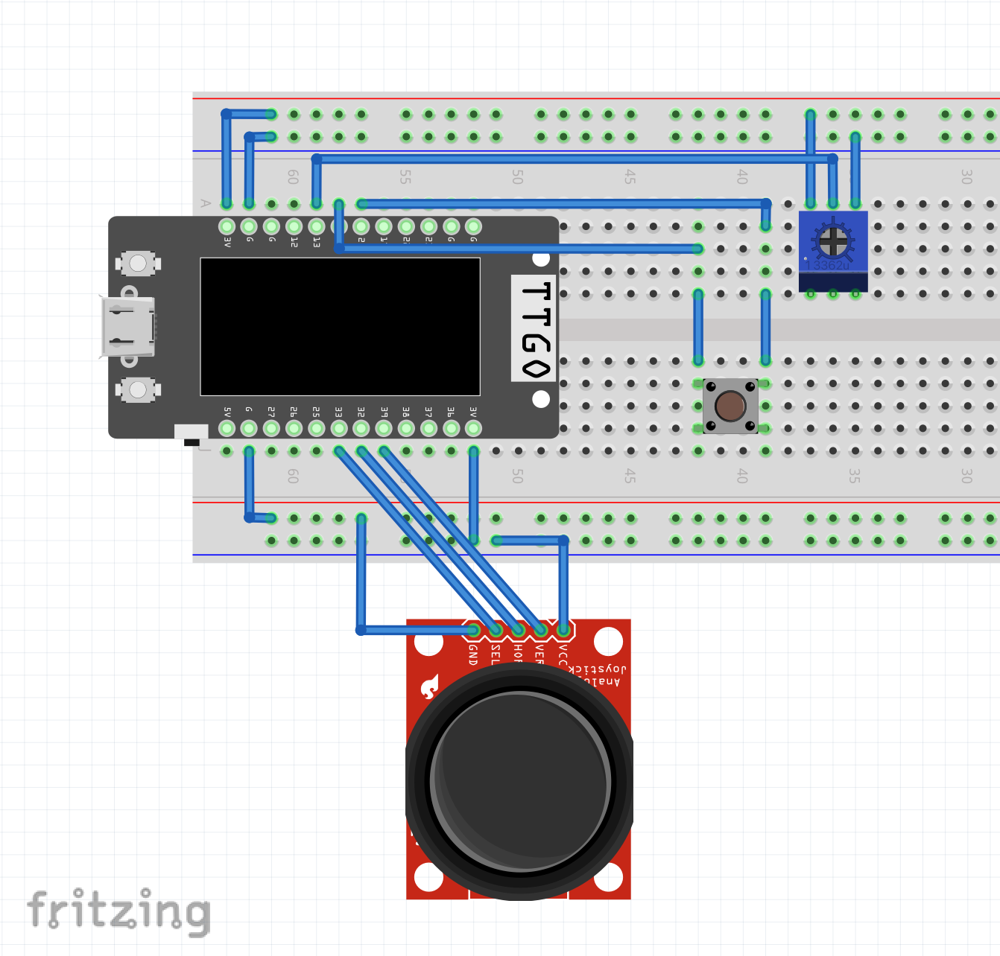

# Module 2 Project - Image Matching Game

## About

This is my Module 2 Interactive Device Project for Creative Embedded Systems with Prof. Tiffany Tseng (Fall 2024). My Module 2 project is a visual reflex test that utilizes the joystick to stop a moving image on a screen when it matches up with the other half. It is a simple image matching game that uses a joystick and button to help children and elderly people with their fine motor skills.

Use the STL files provided in the Assembly 1 folder to 3D print the two parts of the enclosure for the joystick and button. Once finished, solder long leads from your breadboard to the button and joystick and thread through the gaps in the enclosure before screwing the top and bottom together. Congrats, you have a handheld remote for your image matching game!

## Documentation

For detailed documentation, please refer to my [Module 2 Project Documentation on Notion](https://www.notion.so/module-2-project-documentation-1220c2436678800d9118f85c63416e9e).

## Circuit Diagram

